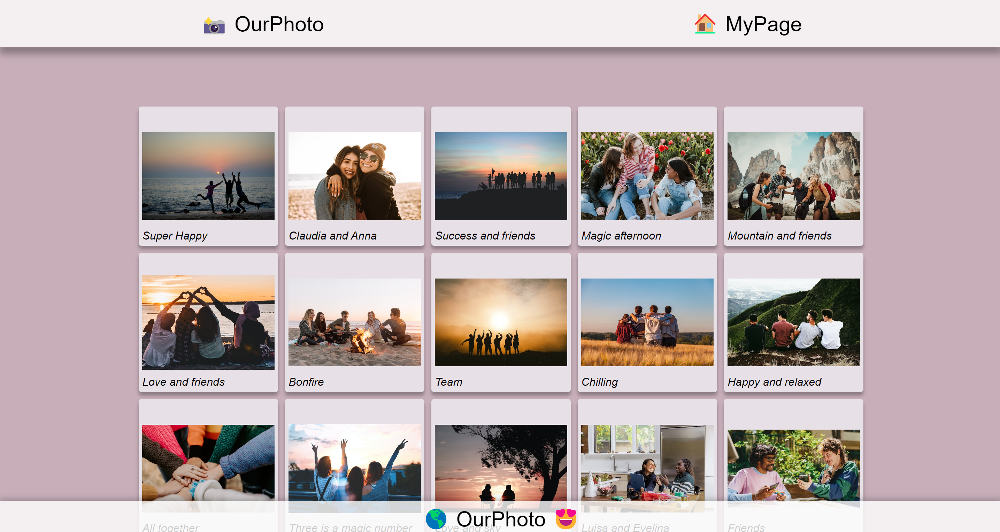
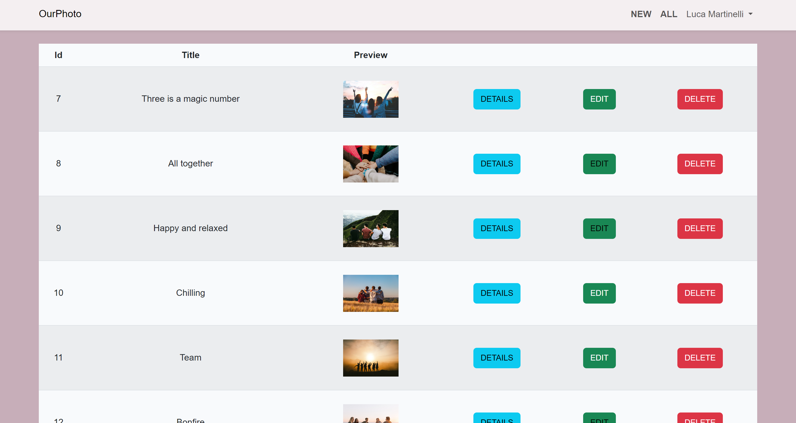

# OurPhoto

OurPhoto is a web application designed for desktop use, built with Laravel, Sass, and Bootstrap.
Its primary purpose is to provide a platform for users to share photos on a common webpage.
With OurPhoto, users can upload and delete their photos, view and edit photo details, and enjoy a shared homepage where they can explore photos from all users.





## Table of content

-   [Features](#Features)
-   [Installation](#Installation)
-   [Usage](#Usage)
-   [License](#license)

## Features

-   User Registration: Users can easily create an account to start sharing their photos.

-   Photo Management: Registered users can manage their photos, including creating, editing, and deleting them.

-   Photo Details: Users can view detailed information about each photo.

-   User Dashboard: The dashboard allows users to manage and view only their photos, providing a personalized experience.

-   Homepage: The homepage displays photos from all users, encouraging exploration and interaction.

-   Data Integrity: When a user account is deleted, all associated photos are also removed, ensuring data cleanliness.

## Installation

To get started with CV Creator, follow these steps:

1. Clone the OurPhoto repository to your local machine:

```bash
  git clone https://github.com/Luega/OurPhoto.git
```

2. Navigate to the project directory:

```bash
  cd /OurPhoto
```

3. Install PHP dependencies using Composer:

```bash
  composer install
```

4. Install JavaScript dependencies:

```bash
  npm install
```

5. Create a .env file by copying the .env.example file:

```bash
  cp .env.example .env
```

6. Generate an application key:

```bash
  php artisan key:generate
```

7. Configure your database settings in the .env file.

8. Run database migrations:

```bash
  php artisan migrate
```

9. Compile assets (CSS and JavaScript):

```bash
  npm run dev
```

10. Start the development server:

```bash
  php artisan serve
```

11. Access the application in your web browser at http://localhost:8000.

## Usage

1. Register a new user account to get started.

2. Once logged in, you can upload, edit, or delete your photos from the user dashboard.

3. Explore photos from other users on the homepage.

## License

This project is licensed under the [MIT](https://choosealicense.com/licenses/mit/) License.
